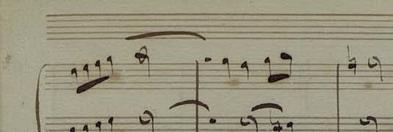
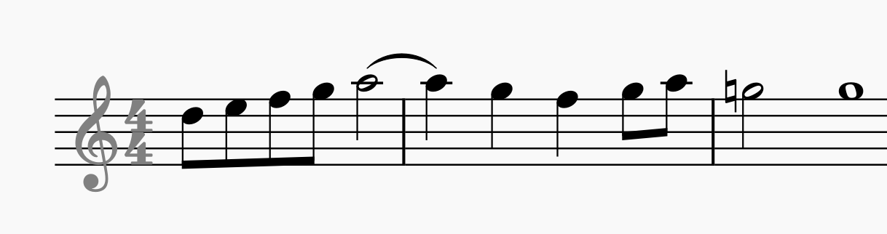
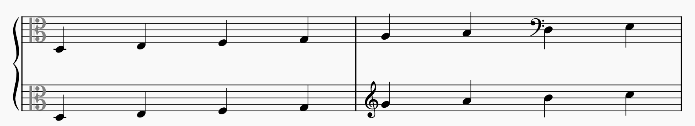
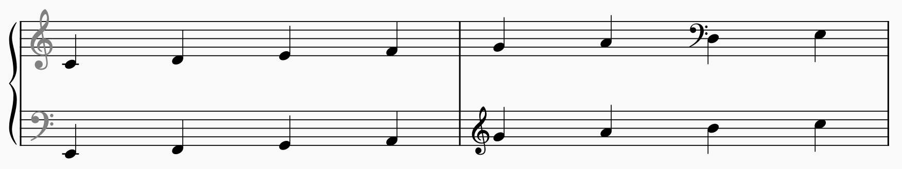

# Omitted staff header normalization

In old handwritten music it is often the case that clefs and key signatures are omitted on new systems and sometimes even new pages (especially in particella). The reader is expected to know them from the previous page:



> **Note:** Example taken from the `CVC.Dolores` dataset, page `CEDOC_CMM_1.5.1_0082.015`, downloadable from [here](http://hdl.handle.net/20.500.12800/1-6147).

This poses problems for MusicXML transcription of these pages (or individual staves), since MusicXML requires these symbols to be present:



The solution for annotators is to look up the correct clef, key signature and time signature from previous pages (to preserve replayability) and put them into the transcription while flagging them as invisible (to preserve the same appearance).

However, annotators are inconsistent and forget to look up everything. The example above should also have a hidden key signature (because there is a natural accidental in the third measure) but the annotator did not note it down in MusicXML.

All of this variability and inconsistency makes it difficult to train an OMR model, because the gold MusicXML's note pitches depend on clefs and key signatures. If the model guesses the invisible clef incorrectly, then even though it recognizes notes properly, they would not align with the gold annotation and a phantom error would appear.

The solution is to normalize all invisible clefs to G clef, and invisible key signatures to null key signature, so that the OMR model learns one consistent behaviour. Note pitches have to be adjusted appropriately to preserve the visual appearance of the rendered MusicXML. Accidentals are not an issue, since they are encoded explicitly (`<accidental>` element) regardless of the actual pitch shift (`<alter>` element).

The `lmx.musicxml.omitted_staff_header` module provides utility functions for this normalization.

> **Note:** The *staff header* refers collectively to clefs, key signatures and time signatures at the beginning of staves. To our best knowledge, there is no well-known musical term for this collection of symbols.


## Clefs

Clef normalization means converting any wild clefs that may be in the data:



To the clefs expected by the OMR model (say G-F clefs for a piano model):



This process requires us to change the clefs themselves, but then also transposing all notes that follow these clefs to preserve their visual appearance on the staff. Notice that the first two notes in the top image are `D3`, while after normalization to G and F clef they become `C4` and `E2` respectively. This transposition must happen for all notes up until a clef change in the respective staff (see clef changes in the second measure).

This transposition is NOT a typical harmonic transposition, because music notation is visually represented as a diatonic scale with two semitones. These two semitones would introduce two accidentals if a naive "fixed-number-of-semitones" transposition was used.

Because the transposition preserves visual appearance, existing accidentals in the score do not pose a problem. Notes that had an accidental originally will have that same accidental after the transposition (which will correspond to the same `<alter>` pitch value). In other words, only the pitch `<step>` and `<octave>` values change.

One issue, though, is posed by key signatures. These introduce `<alter>` values for notes without any visible accidental and the pitches affected by key signature do not change with transposition, while pitches of notes do. This creates a mismatch of alters between notes affected by a key signature before and after the transposition. While the visual `<accidental>` values remain correct, the semantic `<alter>` values become out of sync with them. This is an issue in two respects: first, the MusicXML is invalid, since the visual and semantic data should match; second, MuseScore uses `<alter>` values to determine accidental placement and ignores `<accidental>` values (except for cautionary accidentals). For both reasons, after we transpose pitches, we have to manually go over the score and set `<alter>` values to match the visual accidentals and key signatures present. This is done by invoking the `repair_alters` function on the output of our transposition.

To perform the normalization visualized above, use the following code:

```py
from lmx.musicxml.omitted_staff_header.normalize_invisible_header_clef \
    import normalize_invisible_header_clef
from lmx.musicxml.pitch.Clef \
    import G_CLEF, F_CLEF

normalized_part = normalize_invisible_header_clef(
    part_element=my_part, # MusicXML <part> element as ET.Element
    desired_clef=[G_CLEF, F_CLEF], # default piano clefs
    when_clef_visible="raise-exception", # be careful
)
```

The function returns a modified copy of the input `<part>` element.

The `desired_clef` argument may be one `Clef` or a list of `Clef`s if the part has multiple staves (e.g. piano).

The `when_clef_visible` option controls the function's behaviour when the header clef(s) are not invisible. This is unexpected behaviour, since we call this function precisely to handle invisible header clefs. You can choose from these options:

- `raise-exception`: The careful variant where the function raises a `ValueError`.
- `dont-normalize`: The staff is completely ignored, leaving everything as it is.
- `normalize-keep-visible`: Performs the clef change and note transposition, while keeping the header clef visible.
- `normalize-set-invisible`: Performs the clef change and note transposition, while forcing the header clef to become invisible.

This option applies to each staff independently (except for the exception of course), so if only one clef is visible, that clef's staff will be treated according to these rules, while the other invisible clefs are normalized as usual.

The option you choose depends on what you know about the data you process:

- If you don't know why header clefs should be visible, use `raise-exception`.
- If you know the clef is not visible (some external human annotation) and the MusicXML may be in an unknown visibility state, use `normalize-set-invisible`.
- If you transform data, where the MusicXML definitely has invisible clefs in places where there really are omitted clefs in the image, but some of the data has perfectly normal visible clefs that you want to skip, use `dont-normalize`.
- The `normalize-keep-visible` option is present only for completeness, I'm unsure about when it might be needed.


## Key signatures

Similar to clefs, MusicXML may contain invisible header key signatures. Since they are not visible in the image, an OMR model would think there is the null key signature (the `fifths:0` signature). Normalization here means converting any non-null invisible key signature to the null key signature and adjusting `<alter>` values of the following notes accordingly. This operation also affects accidental `cautionary="yes"` values, which also need to be updated. However with the `repair_alters` method available, we only need to change the key signature and then run the repair method.

> **Note:** Null key signature is special in that, it is ALWAYS invisible when in the header position (inside the part it may be rendered with natural accidentals). This means it is handled in a special way in the normalization function, for example, the header null key signature is never `print-object="no"` since it makes no sense.

To perform normalization to the null signature, use the following code:

```py
from lmx.musicxml.omitted_staff_header.normalize_invisible_key_signature \
    import normalize_invisible_key_signature

normalized_part = normalize_invisible_key_signature(
    part_element=my_part, # MusicXML <part> element as ET.Element
    desired_key=0, # null key signature (the fifths value)
    when_key_visible="raise-exception", # be careful
)
```

The function returns a modified copy of the input `<part>` element.

The `when_key_visible` option controls the function's behaviour when the header key is not invisible. This is unexpected behaviour, since we call this function precisely to handle invisible header keys. You can choose from these options:

- `raise-exception`: The careful variant where the function raises a `ValueError`.
- `dont-normalize`: The key signature is not replaced, only the `repair_alters` function is run, which should do no modifications if the input MusicXML is self-consistent.


## Time signatures

Time signature normalization is the simplest, since it does not affect the musical content of a `<part>` at all. MusicXML does not have the concept of a measure "size", so time signature is only a recommendation and measure duration is simply the duration of its content. While in MuseScore, replacing a time signature may redefine measure bounaries (going from `4/4` to `3/4`), this normalization function does not do that, since measure boundaries are visible in the input image, so the OMR model should produce them correctly irrespective of the chosen time signature. To the OMR model, time signature really is "just" the two numbers at the beginning of the staff, without any further meaning.

For these reasons, time signature may be missing in the MusicXML and MuseScore will happily load it and work with it (it will assume 4 beats per measure to determine overfull/underfull measures, but will render measures properly).

Thefore, for our normalization, we will normalize **to** missing time signature. I.e. we will just erase invisible header `<time>` elements. The following code may be used for that purpose:

```py
from lmx.musicxml.omitted_staff_header.normalize_invisible_time_signature \
    import normalize_invisible_time_signature

normalized_part = normalize_invisible_time_signature(
    part_element=my_part, # MusicXML <part> element as ET.Element
    desired_time=None, # remove the time signature all together
    when_time_visible="raise-exception", # be careful
)
```

You can also provide a precise `<time>` element to be used for the header. It will be copied and its visibility will be set to invisible:

```py
TIME_34 = ET.fromstring(
    "<time><beats>3</beats><beat-type>4</beat-type></time>"
)

normalized_part = normalize_invisible_time_signature(
    part_element=my_part,
    desired_time=TIME_34, # normalize to 3/4 time signature
    when_time_visible="raise-exception",
)
```

The function returns a modified copy of the input `<part>` element.

The `when_time_visible` option controls the function's behaviour when the header time is not invisible. This is unexpected behaviour, since we call this function precisely to handle invisible header times. You can choose from these options:

- `raise-exception`: The careful variant where the function raises a `ValueError`.
- `dont-normalize`: The time signature is not replaced, the whole part is skipped.


## Forcing invisible staff header

Sometimes you know that the image has omitted staff header, yet the MusicXML has the header transcribed as visible. You can explicitly set header symbols as visible or invisible using these function:

Setting header clef visibility:

```py
from lmx.musicxml.omitted_staff_header.set_header_clef_visibility \
    import set_header_clef_visibility

set_header_clef_visibility(
    part_element=my_part, # modifies the <part> in-place
    set_visibility="visible", # or "invisible"
)
```

Setting header key signature visibility:

```py
from lmx.musicxml.omitted_staff_header.set_header_key_visibility \
    import set_header_key_visibility

set_header_key_visibility(
    part_element=my_part, # modifies the <part> in-place
    set_visibility="visible", # or "invisible"
)
```

Setting header time signature visibility:

```py
from lmx.musicxml.omitted_staff_header.set_header_time_visibility \
    import set_header_time_visibility

set_header_time_visibility(
    part_element=my_part, # modifies the <part> in-place
    set_visibility="visible", # or "invisible"
)
```

These functions only work by adding or removing the `print-object="no"` XML attribute.


## Undoing normalization

When normalization is used to train an OMR model, it will learn to output the same G-clef, null key signature combo each time it does not see a clef and/or a key signature. However, when using such a model on a page of music where the first system does have a header, when concatenating results for individual systems, following system headers must be normalized back to the key signature of the first system (or a respective clef/key change). The normalization functions used above may be used for that as well, simply provide the proper desired clef/key and then set the header clef/key to visible/invisible or alternatively completely remove the header if not needed.
